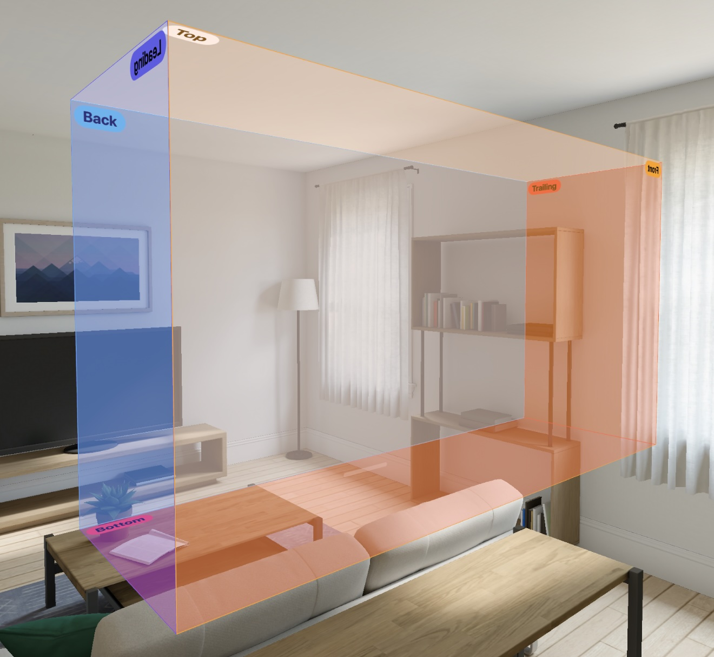
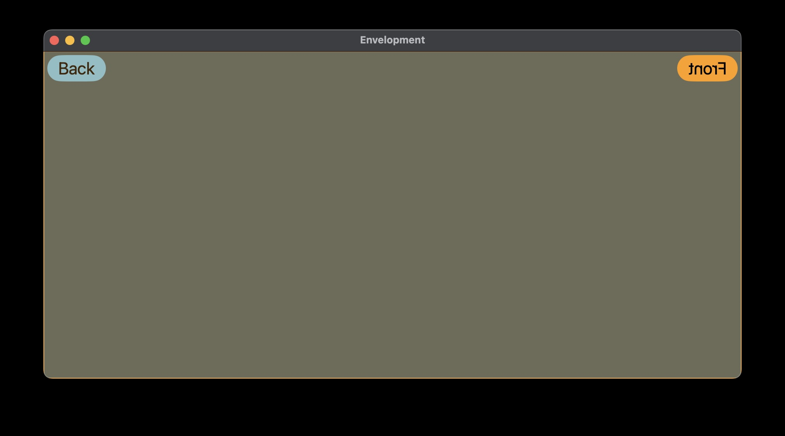

# UIElements

_A work of Noetic Garden — by [millenomi](https://millenomi.name)._

This package package is meant to contain SwiftUI and RealityKit containers for work on 2D and 3D UIs — things like 3D-aware containers, debug visualizers, or RealityKit integrations of those elements.

Currently, it hosts the `Envelopment` container — a SwiftUI container that lets you place views on each side of its bounds. It works in 3D in visionOS, and in 2D on all other Apple OSes:





## Add To Your Project

To add this package to your project, use the following URL in Xcode, by picking File > Add Package Dependencies…

> https://github.com/noeticgarden/uielements.git

Or, add it to your package as a dependency as follows:

```swift
…
// Package.swift
let package = Package(
…
    dependencies: [
        …
        .package(url: "https://github.com/noeticgarden/uielements.git", from: "0.1.0"),
    ],
    …
    targets: [
        .target(…
            dependencies: [
                .product("UIElements", package: "uielements")
            ])
    ]
)
```

## License

The contents of this module are licensed under the MIT license. See the LICENSE file for details.

## Contributions

Use GitHub to [report issues](https://github.com/noeticgarden/uielements/issues) or propose [pull requests](https://github.com/noeticgarden/uielements/pulls).

This package comes with no guarantee that any specific contribution will be included or visibly reviewed, but all issues and pull requests are at least considered. Also, please, be kind; these spaces will be actively moderated at the author's sole discretion.

### 1.0 Acceptance Criteria

This package will be marked source-stable when any Noetic Garden product ships that uses its types. Before then, expect the package to remain source-unstable, using a 0.x [semantic version](https://semver.org/) scheme. Care will be taken to not break clients, but changes may require rewriting existing code or pinning to a specific 0.x release until then.
